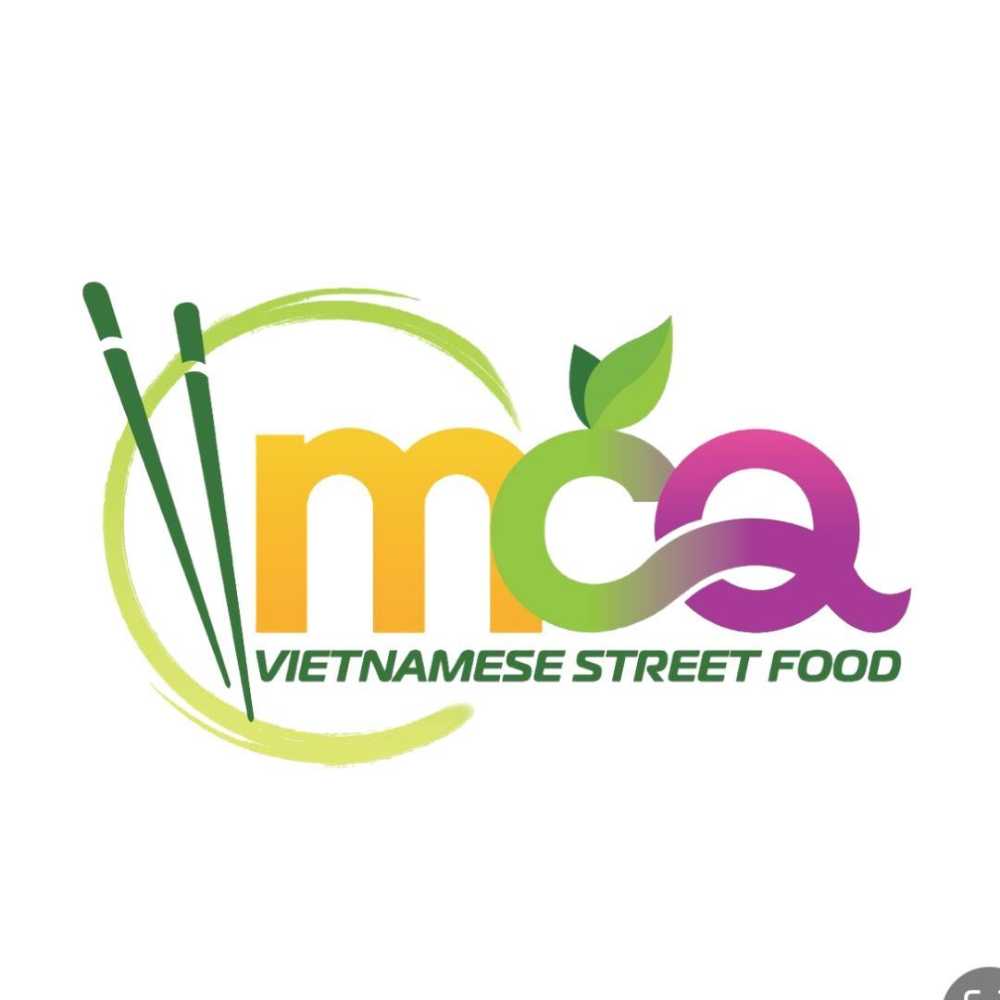

# MCQ Restaurant Scheduled Pickup Ordering and Meal Sharing Platform


## Description

The **MCQ Restaurant Scheduled Pickup Ordering and Meal Sharing Platform** is a web application designed for a Vietnamese restaurant. It allows users to create accounts, browse the menu, place food orders for **scheduled pickup**, and share their favourite meals with other users.

This project is based on a realistic restaurant scenario where customers want a more convenient way to order food online before arriving at the restaurant. The platform is designed as a **client-server web application** and focuses on providing a user-friendly ordering experience while also supporting social interaction through meal sharing.

## Team Members

| UWA ID | Name | GitHub Username |
|--------|------|-----------------|
| 24307608 | Tony Le | utle23 |
| 23957425 | Jovan Pui | jov30 |
| 24220908 | Samuel Ou | slimoftheshady |
| 24181084 | Thomas Zeng | zxx457 |

The application is intended to satisfy the project requirements by including:

- a client-server architecture
- user registration, login, and logout
- persistent user data stored in a database
- the ability for users to view data shared by other users

## Purpose of the Application

The purpose of this application is to solve a real business need by providing an online scheduled pickup ordering system for a restaurant that currently does not have one. It also adds a community element by allowing users to share favourite meals, which makes the platform more interactive and helps satisfy the requirement that users can view data from other users.

The application is designed to be:

- **Engaging** through a clean and appealing restaurant-style interface
- **Effective** by making food ordering more convenient for users
- **Intuitive** through a simple workflow for browsing, ordering, and sharing meals

## System Roles

The platform contains two main sides:

- **User Side** for customers
- **Admin Side** for restaurant administrators

## User Side Features

### User Account Features
Users are able to:
- register a new account
- log in and log out
- view and update profile information

### Ordering Features
Users are able to:
- browse the restaurant menu
- view meal details, including description, price, and ingredients
- add meals to cart
- update meal quantities in cart
- view cart contents and order summary information
- view the total price of their order before checkout
- proceed to checkout
- make a payment through the system
- place an online order
- choose a scheduled pickup date and time
- receive an online PDF receipt and order confirmation after successful checkout
- view previous orders in order history


### Meal Sharing Features
Users are able to:
- save favourite meals
- share favourite meals with other users
- view favourite meals shared by other users

## Admin Side Features

Administrators are able to:
- view registered customer accounts
- manage customer account records
- view customer profile information
- monitor newly registered users
- add new menu items
- edit existing menu items
- remove menu items
- update prices, descriptions, ingredients, categories, and availability status
- view customer orders
- track scheduled pickup times
- monitor order history
- update order status such as Pending, Confirmed, Preparing, Ready for Pickup, and Completed
- view sales and income records
- display monthly income using simple charts for business monitoring

## Example User Workflow

A typical user workflow is as follows:

1. Register an account or log in
2. Browse the menu
3. View meal details
4. Add items to cart
5. Review cart contents, order summary, and total price
6. Proceed to checkout
7. Select a payment method and complete the simulated payment process
8. Choose a scheduled pickup date and time
9. Confirm the order
10. Receive an online receipt and order confirmation
11. View the order in order history
12. Save and share favourite meals
13. Browse favourite meals shared by other users

## Example Admin Workflow

A typical admin workflow is as follows:

1. Log in as an administrator
2. View newly registered users
3. Manage customer account records
4. Update menu items and availability
5. View incoming customer orders
6. Track scheduled pickup times
7. Update order status
8. Review monthly income using charts

## Example Menu Categories

The menu is based on a Vietnamese restaurant and may include items such as:

- **Banh Mi**
- **Bun Bo Hue**
- **Pho**
- **Rice Paper Rolls**
- **Rice Dishes**
- **Drinks**

Each menu item may contain:
- item name
- category
- price
- ingredients
- short description
- availability status

## Application Design

The application follows a traditional web architecture using technologies approved for the unit.

### Client Side
The client side is responsible for displaying web pages, handling user interactions, and sending requests to the server.

### Server Side
The server side handles authentication, ordering logic, profile management, meal sharing, admin management, and sales tracking.

### Database
The database stores persistent data such as:

- user accounts
- login details
- profile information
- menu items
- orders
- favourite meals
- shared meal posts
- sales records

## Branding and Layout Notes

- The MCQ Vietnamese Street Food logo asset lives at `static/images/mcq-logo.jpg`.
- When creating or updating layouts, reference it with Jinja so any template can render the logo:

```html

```
- The `class` attribute above is an example Tailwind utility combination—adjust sizing or spacing per page while keeping the same `url_for` call.
- The shared `templates/base.html` layout already renders the logo inside the header; extend this template from pages such as `index.html` so all customer- and admin-facing screens inherit the same branding automatically.

## Technologies Used

This project uses only technologies allowed in the unit specification.

### Frontend
- HTML
- CSS
- JavaScript
- Tailwind CSS

### Backend
- Flask

### Database
- SQLite
- SQLAlchemy

### Additional Tools
- Jinja templates
- Flask plugins introduced in the unit
- AJAX where needed
- a chart library for income visualisation

### Version Control
- Git
- GitHub

## Installation

### 1. Clone the repository

```bash
git clone https://github.com/jov30/agile-proj.git
cd agile-proj
git checkout main
```

### 2. Create and activate a virtual environment

#### macOS / Linux

```bash
python3 -m venv venv
source venv/bin/activate
python3 -m pip install -r requirements.txt
```

#### Windows

```powershell
py -m venv venv
venv\Scripts\activate
py -m pip install -r requirements.txt
```

### 3. Run the application

#### macOS / Linux

```bash
python3 -m flask --app app run --host 127.0.0.1 --port 5000
```

#### Windows

```powershell
py -m flask --app app run --host 127.0.0.1 --port 5000
```

Then open your browser and go to:

```text
http://127.0.0.1:5000
```

### 4. Environment variables

No extra environment variables are required for the current public-site build.

## Running the Application

If your virtual environment is already activated, use the same Flask command above for your operating system.

## Running the Tests

Test files are currently placeholders and the automated test suite is not fully set up yet.

## Project Structure

```text
project-root/
│
├── app.py
├── feature_pages.py
├── requirements.txt
├── README.md
├── config.py
├── models.py
├── data/
│   ├── menu-image-sources.json
│   ├── menu-prices.json
│   ├── menu-source.txt
│   └── visual-inspiration-sources.json
├── routes/
│   ├── __init__.py
│   ├── admin.py
│   ├── auth.py
│   ├── helpers.py
│   ├── menu.py
│   ├── orders.py
│   └── user.py
├── scripts/
│   ├── build_menu_json.py
│   └── download_menu_images.py
├── templates/
│   ├── base.html
│   ├── feature-page.html
│   ├── index.html
│   ├── admin/
│   │   └── orders.html
│   ├── auth/
│   │   ├── login.html
│   │   └── register.html
│   ├── menu/
│   │   ├── cart.html
│   │   ├── checkout.html
│   │   └── menu.html
│   └── user/
│       └── orders.html
├── static/
│   ├── css/
│   │   └── main.css
│   ├── data/
│   │   └── menu.json
│   ├── js/
│   │   ├── admin.js
│   │   ├── cart.js
│   │   └── checkout.js
│   └── images/
│       ├── brand/
│       ├── inspiration/
│       ├── menu/
│       ├── mcq-logo.jpg
│       └── .gitkeep
├── instance/
│   └── app.db
└── tests/
    ├── test_admin.py
    ├── test_auth.py
    ├── test_menu.py
    └── test_orders.py
```

## Menu Data & Assets

- `data/menu-source.txt` contains the plain-text export of the menu document you shared so we can regenerate structured data without relying on external files.
- `data/menu-prices.json` captures the price sheet we inferred from your photo references and the “Price setup” document; tweak numbers here to keep the UI synced with the restaurant boards.
- `scripts/build_menu_json.py` parses that source and writes `static/data/menu.json`, which powers the interactive menu browser on the site.
- New hero images live under `static/images/menu/` (sourced from Unsplash as illustrative placeholders) and are referenced per category.
- Whenever the menu doc changes, run `python3 scripts/build_menu_json.py` to refresh the JSON feed before committing.

## Notes on Scope

This project focuses on **scheduled pickup ordering** rather than real-time queue management. This decision keeps the project manageable for a student development team while still meeting the core requirements of the unit.

The payment process in this project is **simulated for demonstration purposes** and is not connected to a real payment gateway.

The meal sharing feature was included to ensure that users can view data shared by other users in a meaningful and relevant way.

The admin dashboard and monthly income chart were included to provide useful restaurant-side management features while remaining within the scope of a student web application project.

## Troubleshooting

### Database Issues

The current public-site build does not require a database initialization step before startup.

### Missing Dependencies

Make sure all required packages are installed:

```bash
python3 -m pip install -r requirements.txt
```

On Windows:

```powershell
py -m pip install -r requirements.txt
```

### Application Startup Errors

Check that:
- your virtual environment is activated
- dependencies were installed from `requirements.txt`
- you are running the app from the project root
- you are on the `main` branch if you want the default project version

### General Errors

Check the Flask server logs for error messages and stack traces.

## External Sources Used

Possible external sources and libraries used in this project may include:

- Tailwind CSS
- Chart.js or another chart library
- Google Fonts
- Font Awesome or another icon library
- Restaurant images or placeholder images used for UI design

This section should be updated to reflect the actual external resources used by the final project.

## Future Improvements

Possible future improvements include:

- downloadable PDF receipts
- add feature instant online order
- email confirmation
- recommendation features based on user preferences
- more advanced restaurant analytics
- role-based staff accounts with different permission levels
- real-time queue management for instant pickup orders

## Conclusion

The **MCQ Restaurant Scheduled Pickup Ordering and Meal Sharing Platform** is a realistic and achievable web application project that combines restaurant ordering functionality with a small social sharing feature. It meets the key requirements of the unit by using a client-server architecture, supporting authentication, storing persistent user data, and allowing users to view content shared by others. In addition, it provides admin-side tools for customer management, order tracking, menu control, and monthly income monitoring.
